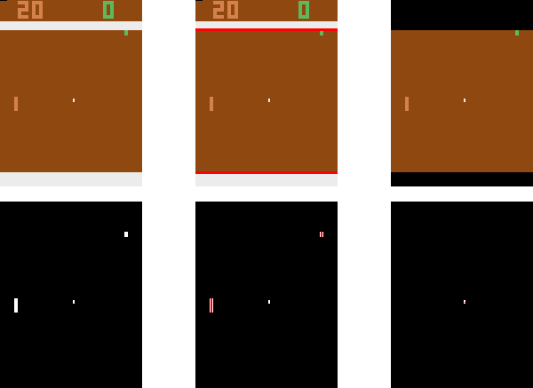
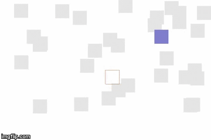
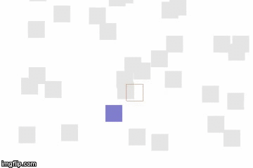

# rl-hackathon-2017

## Pre-requisites

### Resources
This repo assumes familiarity in ML in general(algorithms, tools). Our starting point was reading these well-written introductory posts on Reinforcement Learning. We highly recommend reading these posts before moving forward.

- [Deep Reinforcement Learning: Pong from Pixels](http://karpathy.github.io/2016/05/31/rl/)
- [Q-Learning And Exploration](https://studywolf.wordpress.com/2012/11/25/reinforcement-learning-q-learning-and-exploration/)
- [Learning Reinforcement Learning](http://www.wildml.com/2016/10/learning-reinforcement-learning/)
- [Action-Value Methods and n-armed bandit problems](http://outlace.com/Reinforcement-Learning-Part-1/)
- [Demystifying Deep Reinforcement Learning](https://www.nervanasys.com/demystifying-deep-reinforcement-learning/)
- [Deep Deterministic Policy Gradients in TensorFlow](http://pemami4911.github.io/blog/2016/08/21/ddpg-rl.html)

In addition to these awesome resources, there are bunch of open-source RL implementations out there, we make use of following resources as starting points and built on top of them:
- [Actor Critic with OpenAI Gym¶](https://github.com/gregretkowski/notebooks/blob/master/ActorCritic-with-OpenAI-Gym.ipynb)
- [DQN with Experience Replay](https://github.com/sherjilozair/dqn)
- [Stochastic Policy Gradients on Pong](https://gist.github.com/karpathy/a4166c7fe253700972fcbc77e4ea32c5)

### Tools
To move quickly we make use of following tools:
- [OpenAI's Gym](https://gym.openai.com/docs) for experimental environment. Before writing a single line of code, we recommend reading the documentation.
- [Keras](https://keras.io/) for quicky prototyping neural network models.
- [Jupyter Notebooks](http://jupyter.org/) for fast and interactive development.

## Algorithms
Here we briefly explain 3 RL algorithms where we implemented in this repository. You can use the type of agent un `run_environment.py`. Please take a look at corresponding implementation under `rl/agents/`. We use Pong as an example environment. But first we do preprocessing so that we can do faster experiments.

##### From RGB-Pong to Number-Pong
The OpenAI game [RGB-Pong](https://gym.openai.com/envs/Pong-v0) provides a 210x160x3 RGB images to be used as a state. We simplified this state to 6 numbers using image processing. The steps are visualized in this graphic:

First we identify the field enclosed by the two white lines (1-3). Then we create a mask of all objects within the field by testing each pixel whether it is the background color (4). Both bars are 16x4. However, they can be partly occluded by the surrounding white lines. Therefore, we apply a erosion of 1x4 in the two columns where bars can occur to find them, we keep the center point of each bar (even if occluded; 5). After we have found the bars, we remove them and erode with 4x2 to find the remaining ball, which is never occluded (6).

The x position of the two bars are not relevant, leaving 4 numbers. In addition with the  movement vector of the ball, we reduced RGB-Pong to 6 numbers.

### Q-Learning
A function called Q does theoretically exist, it returns for the current state and action the total future reward until the terminal state is reached. So Q resembles the best possible scores achievable from now in game. Deep Q-Learning tries to converge to this theoretically function. A history of states, action, rewards, and new states are generated by an agent interacting with an environment. An existing rough approximation of Q can then be trained to approximate Q better by using the history:
`Q(state_t, action_t) = reward_t + decay * max_{a}(state_{t+1}, a)`
The current Q value (one the left) should be the currently received reward plus future reward from the state we transitioned into.

### Vanilla Policy Gradients

### Actor-Critic Policy Gradients

## Creating A New Environment:
If you would like to exploit the Gym for a target task in your mind, you can create a new environment. For an example, we would like to create an environment for a simplified computer vision problem.
We would like to localize a target object in a scene. Here agent can move a frame and the aim is to find the object in this scene.

Starting from [CartPole](https://github.com/openai/gym/blob/master/gym/envs/classic_control/cartpole.py) implementation, we implemented a simple environment. All you need to figure out how to draw simple objects. 
You can find [new environment code](rl/environments/object_localization.py) and an [example notebook](notebooks/new_environment.ipynb) under this repository. You place `object_localization.py` under `/gym/envs/classic_control/`. Also, you need to edit a couple of initialization files as explained [here](https://github.com/openai/gym/wiki/Environments). Here's an agent in action in this environment:

